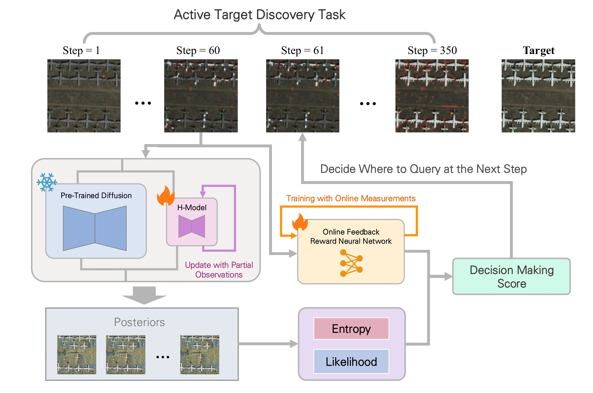
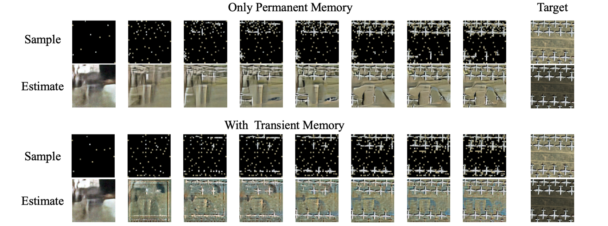

# EM-PTDM: Expectation Maximized Permanent Temporary Diffusion Memory
Implementation of _Active Target Discovery under Uninformative Priors: The Power of Permanent and Transient Memory_.

<div align="center">

[Anindya Sarkar*](https://scholar.google.co.in/citations?user=2hQyYz0AAAAJ&hl=en),
[Binglin Ji*](https://keving396.github.io/kevinji.github.io//),
[Yevgeniy Vorobeychik](https://vorobeychik.com/)
  

</div>

This repository is the official implementation of the **NeurIPS 2025 paper** _Active Target Discovery under Uninformative Priors: The Power of Permanent and Transient Memory_. Drawing inspiration from neuroscience, in this work, we introduce Expectation Maximized Permanent Temporary Diffusion Memory (EM-PTDM), a novel approach that enables effective active target discovery even in settings with uninformative priors, ensuring robust exploration and adaptability in complex real-world scenarios.

<div style="display: flex; justify-content: center;">
  
  
</div>


## Installation
Install required Tensorflow, JAX and Keras version:
```bash
pip install --extra-index-url https://pypi.nvidia.com tensorflow[and-cuda]==2.15.0
pip install --find-links https://storage.googleapis.com/jax-releases/jax_cuda_releases.html jax[cuda12_pip]==0.4.26
pip install --upgrade keras==3.1.1
pip install --upgrade keras-cv
pip install wandb albumentations pillow matplotlib
```

## An Overview of EM-PTDM

<div align="center">

</div>

## Train a Pre-trained Diffusion Model (Prior)
* Train your own diffusion model using `python train_ddim.py --config=/path/to/config --data_root=/path/to/data/root --run_dir=/path/to/save/model/`.
* For example, train on ImageNet using `train_ddim.py --config=configs/training/ddim_train_imagenet.yaml --data_root=data/ --run_dir=trained_models/`, config your data in .yaml file


## Inference EM-PTDM
* First, train the prior as we described in the last step.
* Choose one of the configs in `configs/inference`, you can edit this config.
* Then run inference using
```bash
KERAS_BACKEND="jax" python inference_EM_PTDM.py --config=/path/to/inference/config --data_root=/path/to/data/root --target_img /path/to/target/img --mask_img /path/to/target/mask_img --train_h_model_config=/path/to/h_model/training/config`
```
e.g. An example of active target discovery on a sample from DOTA using ImageNet prior:
```bash 
KERAS_BACKEND="jax" python inference_EM_PTDM.py --config=configs/inference/EM_PTDM_imgnet.yaml --data_root=data --target_img sample_images/9036.png --mask_img sample_images/9036_mask.png --train_h_model_config=configs/training/ptdm_imgnet.yaml 
```
* During sampling, the fine-tuned h-model will be saved in `testem` folder, don't remove any files.
* Your results will be saved in `trained_models/your_prior_model/inference/`.


## NOTE:
* If you want to test MNIST, please first modify reward model's parameters in `pix_nn.py`, then modify `datasets.py`'s read_image function's channels to 1, and modify `ActiveSampler.py`'s' block_size to 1, finally modify the `.yaml` file name in subprocess code in `h_trans.py`(function `active_sampling`), to reproduce the results. It will still be fine if you want to do block_size larger than 1.
